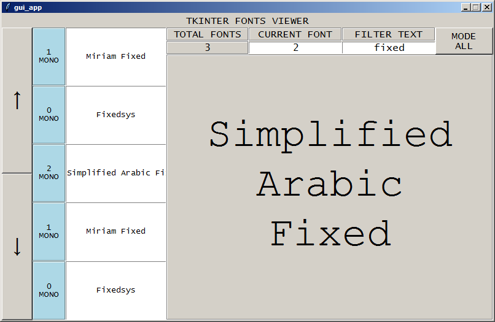
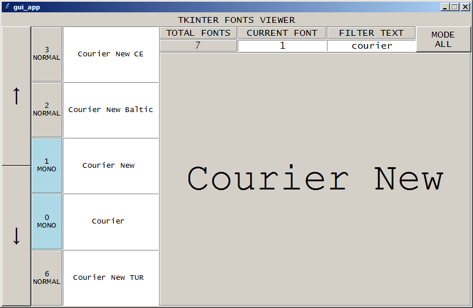

tkinter_fonts_viewer
===========
Gui viewer for tkinter fonts

Info
===========
Application allows us, to view tkinter fonts. It shows font types (normal/mono). We can switch between them - all/normal/mono. We can filter fonts, with specified text.

Install
===========

.. code-block:: python

    pip install tkinter_fonts_viewer

Usage from python
===========

.. code-block:: python

    from tkinter_fonts_viewer import viewer

    viewer()
    # then just press enter, and wait for gui app to start running
    
    
.. code-block:: python

    from tkinter_fonts_viewer import fonts_type
    
    fonts = fonts_type()
    # it creates dict with known fonts type (normal/mono)
    
Usage from command line
===========

.. code-block::

    fonts_viewer

Example application views
===========

