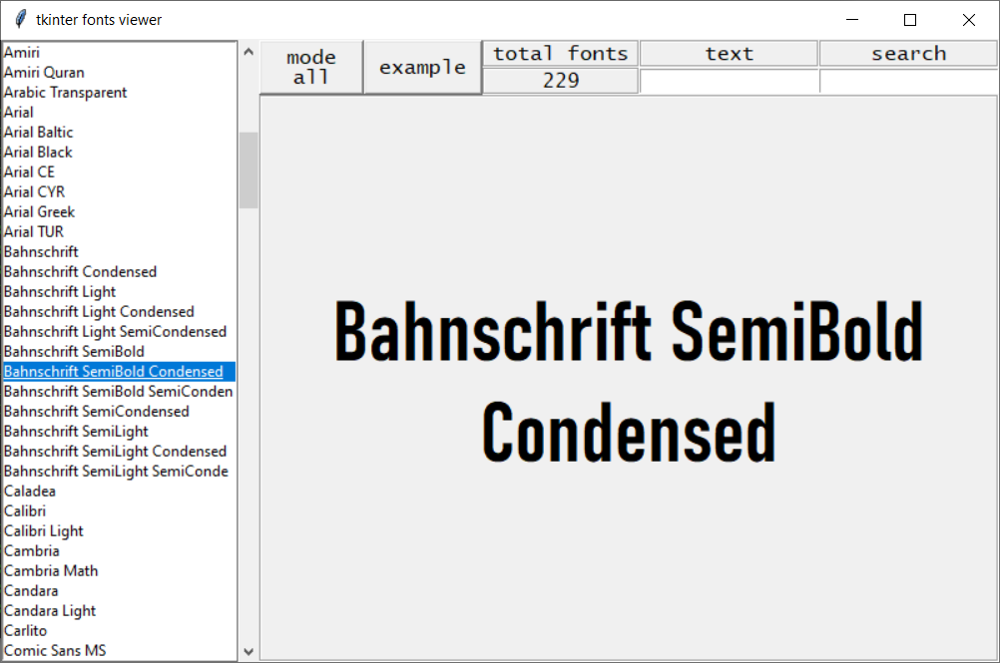
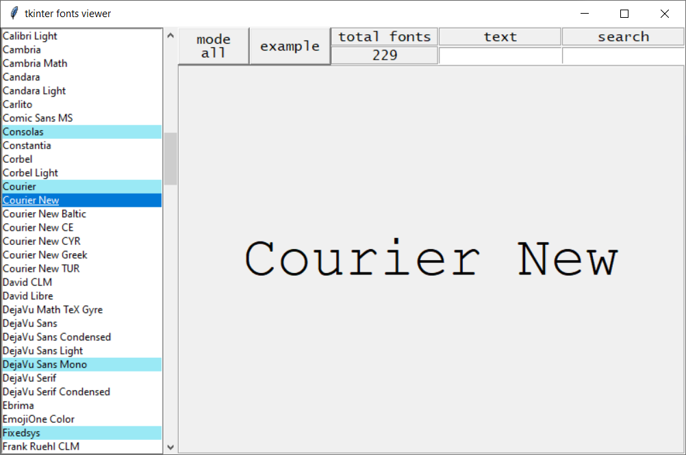
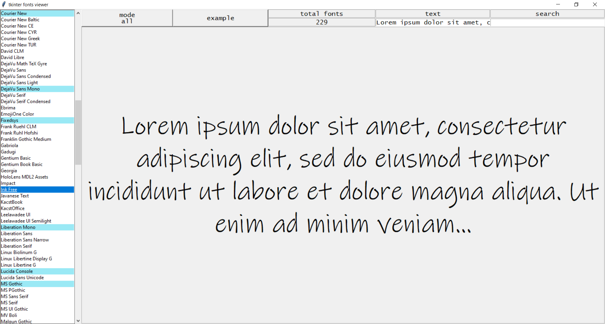

*****
tkinter_fonts_viewer
*****

GUI application for viewing tkinter fonts. It shows text for specified font. We can switch between font types - all/normal/mono. We can filter fonts, with specified text.

Install
########

.. code-block:: python

    pip install tkinter_fonts_viewer

Usage from python
########

.. code-block:: python

    from tkinter_fonts_viewer import viewer

    viewer()
    # calls gui viewer from python
    
    
.. code-block:: python

    from tkinter_fonts_viewer import fonts_type
    
    fonts = fonts_type()
    # creates dict with known fonts type (normal/mono)
    
Usage from command line
########

.. code-block::

    fonts_viewer

Example application views
########

Update/Todo
########

07.01.2022
**********************

 - resizable window

 - listbox widget to choose fonts

 - "text" entry for user input text

 - "example" button with example text

 - auto wrapping text in main label

01.06.2020
**********************

 - main view
 
 - search entry
 
 - fonts type (normal/mono) json
 
 - oldstyle listbox

todo/to consider
**********************

 - checkbutton for bold/curve fonts

 - option for font resizing

 - color picker

 - night mode

 - redesign of top menu

 - enumeration of fonts in listbox
